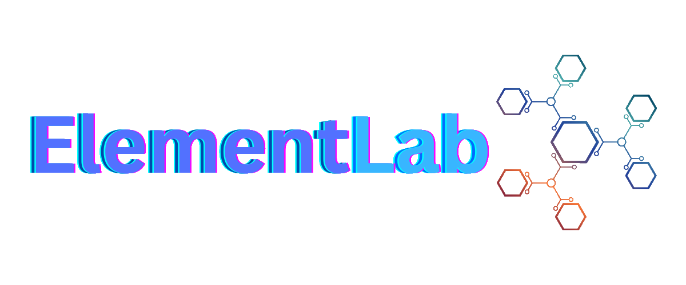
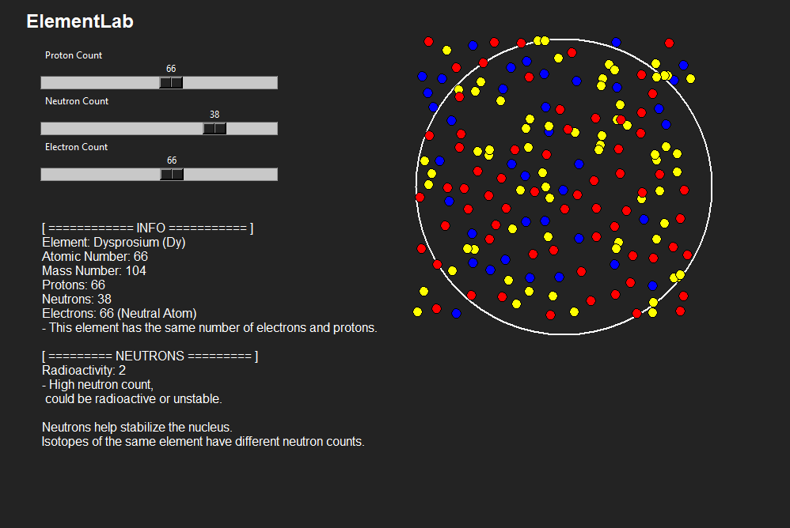

---

**ElementLab** is a desktop app that lets you explore all the elements of the periodic table. 🧑‍🔬✨

### 🌟 **Features**:
- 🔬 **118 Elements**: Access every element from 1 to 118!
- 🔍 **Element Search**: A menu to easily search for elements.
- ⚙️ **Sliders**: Adjust protons, neutrons, and electrons with customizable sliders.
- 🏷️ **Information Label**: Detailed information labels for each element.
- 🖼️ **Images**: View an image of each element.

Embark on a deep dive into the world of elements with **ElementLab**! 🌌

---

### **Here’s a Screenshot of the App**:

---
